---
{"dg-publish":true,"permalink":"/docs/git/multi-env-promotion-flow/","tags":["git","deployment","control-flow","version-control"]}
---

# Git Multi-Environment Promotion Flow

Using `TICKET-101` as example. Replace with your actual ticket/branch names.

---

## Phase 1 — Feature Development (on develop)

```bash
# Pull latest develop
git checkout develop
git pull origin develop

# Create your feature branch
git checkout -b feature/TICKET-101

# ... do your work, commit as you go ...
git add .
git commit -m "TICKET-101: Add new feature description"

# Push feature branch to remote
git push -u origin feature/TICKET-101
```

> Open a PR if your team requires it: `feature/TICKET-101 → develop`

---

## Phase 2 — Squash Merge into Develop

This collapses all your feature commits into **one single commit**. That one commit is what you'll cherry-pick later.

```bash
# Make sure develop is up to date
git checkout develop
git pull origin develop

# Squash merge your feature branch
git merge --squash feature/TICKET-101

# Commit the squash (this creates the single commit you'll promote)
git commit -m "TICKET-101: Add new feature description"

# Push develop
git push origin develop

# ⚠️  IMPORTANT: Copy this commit hash — you'll need it in Phase 3 and 4
git log --oneline -1
# Output example: a1b2c3d TICKET-101: Add new feature description
#                 ^^^^^^^ save this

# Clean up feature branch
git push origin --delete feature/TICKET-101   # delete remote
git branch -d feature/TICKET-101              # delete local
```

---

## Phase 3 — Promote to Test

Create a promotion branch **from test**, cherry-pick your single commit into it, then PR that into test. The PR will only show your changes.

```bash
# Make sure test is up to date
git checkout test
git pull origin test

# Create promotion branch FROM test (not from develop)
git checkout -b promote/TICKET-101-to-test

# Cherry-pick the squashed commit from Phase 2
# Replace a1b2c3d with your actual hash
git cherry-pick a1b2c3d

# If Liquibase conflict shows up (rare with split changelogs):
#   git add db/changelog/features/TICKET-101.xml
#   git cherry-pick --continue

# Push the promotion branch
git push -u origin promote/TICKET-101-to-test
```

> Open PR: `promote/TICKET-101-to-test → test` Reviewer sees only your changes. Merge and delete the promotion branch.

```bash
# After PR is merged, clean up locally
git checkout test
git pull origin test
git branch -d promote/TICKET-101-to-test
git push origin --delete promote/TICKET-101-to-test
```

---

## Phase 4 — Promote to Main (Prod)

Exact same pattern as Phase 3, but targeting `main`. You cherry-pick the **same commit hash** from Phase 2.

```bash
# Make sure main is up to date
git checkout main
git pull origin main

# Create promotion branch FROM main
git checkout -b promote/TICKET-101-to-prod

# Cherry-pick the same squashed commit
git cherry-pick a1b2c3d

# If conflict, resolve and continue:
#   git add db/changelog/features/TICKET-101.xml
#   git cherry-pick --continue

# Push
git push -u origin promote/TICKET-101-to-prod
```

> Open PR: `promote/TICKET-101-to-prod → main` Merge after sign-off, then tag the release.

```bash
# After PR is merged, tag the release
git checkout main
git pull origin main
git tag -a v2.1.0 -m "Release v2.1.0 - TICKET-101"
git push origin v2.1.0

# Clean up
git branch -d promote/TICKET-101-to-prod
git push origin --delete promote/TICKET-101-to-prod
```

---

## Full Flow Summary

```
feature/TICKET-101          → squash merge →  develop
                                                 |
                                          cherry-pick (a1b2c3d)
                                                 |
                                                 ↓
promote/TICKET-101-to-test  ← cherry-pick ←  (from test)  → PR → test
                                                                    |
                                                             cherry-pick (a1b2c3d)
                                                                    |
                                                                    ↓
promote/TICKET-101-to-prod  ← cherry-pick ←  (from main)  → PR → main → tag
```

---

## The One Thing That Makes This Work Smoothly

Keep your Liquibase changelogs split by ticket:

```
db/changelog/
  master.xml                  ← uses <includeAll> or <include>, rarely touched
  features/
    TICKET-101.xml            ← your migrations live here
    TICKET-102.xml            ← someone else's, you never touch this
```

Each cherry-pick only carries **your** changelog file. No one else is modifying it, so conflicts disappear.

```mermaid
flowchart TD
    A([🚀 Start]) --> B[checkout develop\ngit pull origin develop]
    B --> C[Create feature branch\ngit checkout -b feature/TICKET-101]
    C --> D[👨‍💻 Work & Commit\ngit add . && git commit]
    D --> E[Push feature branch\ngit push -u origin feature/TICKET-101]
    E --> F{PR Required?\nfeature/TICKET-101 → develop}
    F -->|Yes| G[Open & Merge PR]
    F -->|No| H

    G --> H[Squash Merge into develop\ngit merge --squash feature/TICKET-101\ngit commit]
    H --> I[📌 Save commit hash\ngit log --oneline -1\nExample: a1b2c3d]
    I --> J[🗑️ Delete feature branch\nlocal & remote]

    subgraph PHASE3 ["📦 Phase 3 — Promote to Test"]
        direction TB
        K[checkout test\ngit pull origin test] --> L[Create promotion branch FROM test\ngit checkout -b promote/TICKET-101-to-test]
        L --> M[Cherry-pick squashed commit\ngit cherry-pick a1b2c3d]
        M --> N{Conflict?}
        N -->|Yes| O[Resolve & continue\ngit cherry-pick --continue]
        N -->|No| P
        O --> P[Push promotion branch\ngit push -u origin promote/TICKET-101-to-test]
        P --> Q{PR\npromote/TICKET-101-to-test → test}
        Q --> R[✅ Merge & delete\npromotion branch]
    end

    subgraph PHASE4 ["🚢 Phase 4 — Promote to Prod"]
        direction TB
        S[checkout main\ngit pull origin main] --> T[Create promotion branch FROM main\ngit checkout -b promote/TICKET-101-to-prod]
        T --> U[Cherry-pick same commit\ngit cherry-pick a1b2c3d]
        U --> V{Conflict?}
        V -->|Yes| W[Resolve & continue\ngit cherry-pick --continue]
        V -->|No| X
        W --> X[Push promotion branch\ngit push -u origin promote/TICKET-101-to-prod]
        X --> Y{PR\npromote/TICKET-101-to-prod → main}
        Y --> Z[✅ Merge, tag & delete\ngit tag -a v2.1.0]
    end

    J --> K
    R --> S
    Z --> END([🎉 Done])
```

